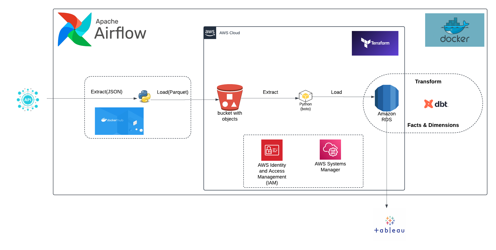
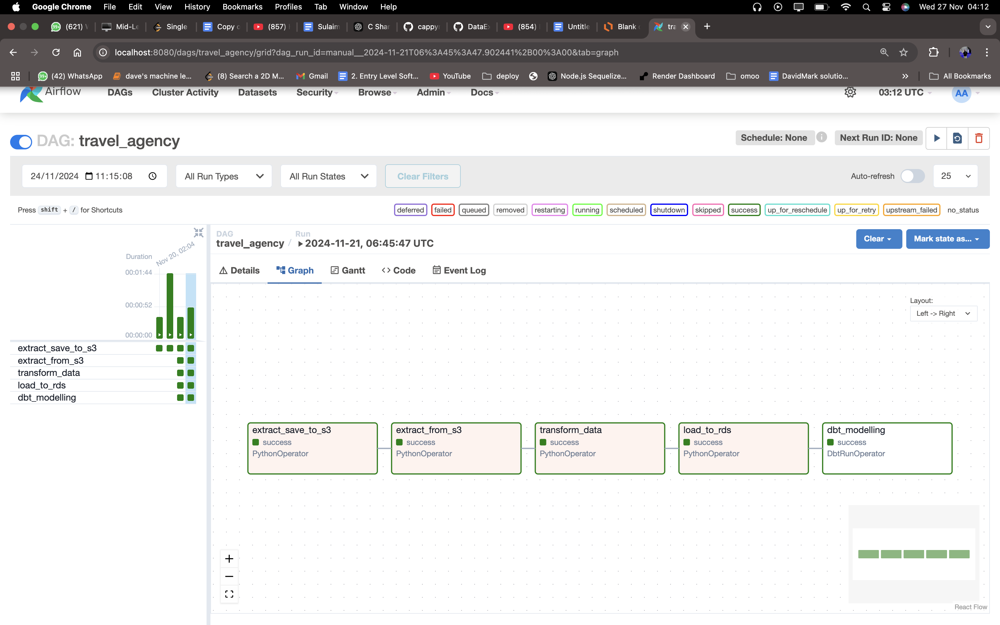
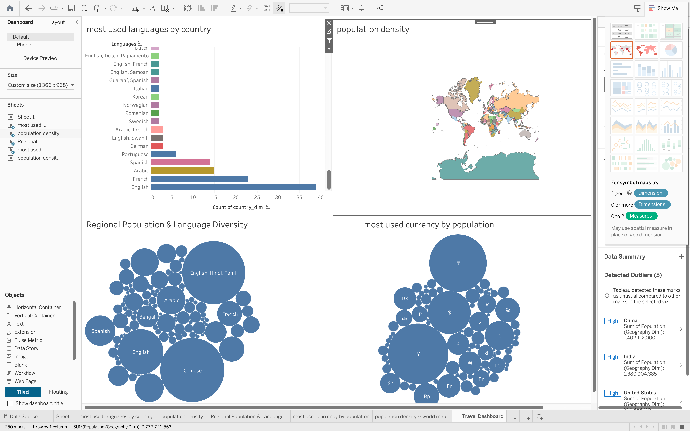

# Data Processing and Transformation Pipeline

## Table of Contents

1. [Introduction](#introduction)
2. [Architecture](#architecture)
3. [Tools and Technologies](#tools-and-technologies)
4. [Setup and Usage](#setup-and-usage)
5. [CI/CD Pipeline](#ci-cd-pipeline)
6. [Directory Structure](#directory-structure)
7. [Future Work](#future-work)

---

## Introduction

This project automates the extraction, transformation, and loading (ETL) of data using a robust pipeline built with Terraform, Airflow, DBT, and Docker. The pipeline orchestrates data workflows to:

- Extract raw data from APIs.
- Transform the data into Facts and Dimensions using DBT.
- Store the data into RDS for further analytics.

---

## Architecture



### Components

- **Data Ingestion**: Extract raw data from APIs and upload it to S3.
- **Storage**: Use S3 for raw storage and RDS for structured data.
- **Orchestration**: Airflow manages pipeline execution via DAGs.
- **Transformation**: DBT handles data modeling into Facts and Dimensions.
- **Provisioning**: Terraform provisions cloud infrastructure (S3, RDS, IAM).
- **CI/CD**: Automates linting, building, and deployment of Docker images.

---

## Tools and Technologies

- **Terraform**: Infrastructure as Code for scalable provisioning.
- **Airflow**: Orchestrates ETL workflows using directed acyclic graphs (DAGs).
- **DBT**: Simplifies SQL transformations for modeling data.
- **Docker**: Containerizes workflows for consistent deployments.
- **GitHub Actions**: Implements CI/CD for automated linting and deployment.
- **AWS**: Hosts S3 for storage and RDS for databases.

---

## Setup and Usage

### Pre-requisites

1. Install Docker, Terraform, and AWS CLI.
2. Set up AWS credentials for Terraform and Airflow.

### Steps

1. **Clone the Repository**:

   ```bash
   git clone <repo-url>
   cd Mile-stone-project
   ```

2. **Provision Infrastructure**:

   ```bash
   cd infrastructure/
   terraform init
   terraform apply
   ```

3. **Run Airflow**:

   ```bash
   cd airflow/
   docker-compose up -d
   ```

4. **Trigger Airflow DAGs**:

   - Use the Airflow UI to trigger DAGs for extraction, transformation, and loading.

5. **Monitor CI/CD**:
   - Push changes to GitHub to trigger the CI/CD pipeline.

---

## CI/CD Pipeline

### Continuous Integration (CI)

1. Lint Python code using `flake8`.
2. Ensures adherence to PEP 8 standards.

### Continuous Deployment (CD)

1. Builds a Docker image for data processing.
2. Pushes the Docker image to Docker Hub.

### Configuration

- `.github/workflows/ci_cd.yml` automates the pipeline.
- CI/CD workflow triggers on every push to the `main` branch.

---

## Dags



## Directory Structure

```
Mile-stone-project/
├── airflow/
│   ├── dags/
│   │   ├── data_processor/
│   │   │   ├── extract_api_data.py
│   │   │   ├── load_to_s3.py
│   │   ├── services/
│   │   │   ├── api_handler.py
│   │   │   ├── config.py
│   │   │   ├── extract_from_s3.py
│   │   │   ├── rds_loader.py
│   │   │   ├── s3_uploader.py
│   │   │   ├── transform_s3.py
│   │   ├── travel_agency.py
│   ├── docker-compose.yml
│   ├── Dockerfile
├── dbt/
│   ├── travel_agency/
│   │   ├── models/
│   │   ├── dbt_project.yml
├── infrastructure/
│   ├── main.tf
│   ├── modules/
│   │   ├── rds/
│   │   ├── s3/
│   │   ├── iam/
├── .github/
│   ├── workflows/
│   │   ├── ci_cd.yml
```

## Tableau Dashboard



---

## Future Work

- Add real-time monitoring to Airflow and DBT workflows.
- Expand pipeline to support additional data sources.
- Integrate data quality checks and alerts.

---

## License

This project is licensed under the MIT License - see the LICENSE file for details.
